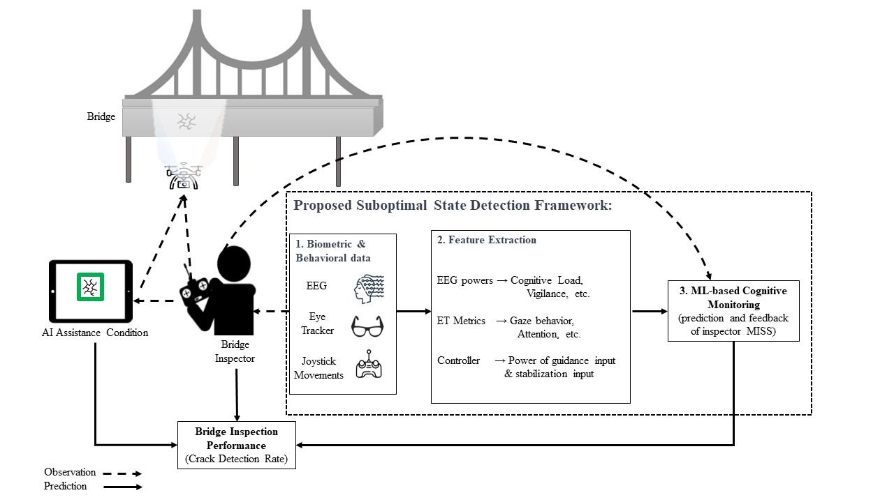
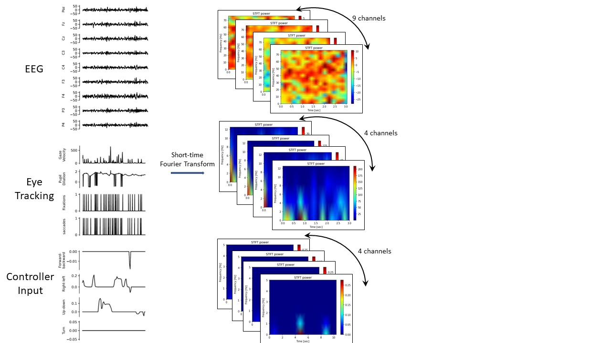

# Multimodal Detection of Suboptimal States in Bridge Inspectors Through Implementation of Deep Learning

## Project Overview
This project aims to leverage deep learning and various fusion techniques to improve the classification outcomes of cognitive state detection systems for bridge inspectors. The primary objective is to identify instances when bridge inspectors either overlook or successfully identify cracks during inspections.

## Methodology

### 1. Data Description
The dataset comprises biometric and behavioral data collected from an experiment where participants inspected a bridge under two conditions: without AI assistance and with AI augmentation. The data includes EEG signals, eye-tracking metrics, and controller inputs, recorded while participants inspected a total of 24 cracks (20 in the no AI condition and 4 missed by AI in the AI condition). The study involved 45 participants, resulting in 1080 instances labeled as either “Miss” or “Detect”.


### 2. Signal Preprocessing
Data preprocessing involved baseline normalization to eliminate individual differences in EEG and pupillometry signals. Signals were transformed into their spectrogram representations using Short-Time Fourier Transform (STFT) with a Hanning window.



### 3. Data Augmentation
A sliding window technique was used to augment the dataset, resulting in 4320 instances of miss/detect events. This method enhances the dataset's size and diversity by including different time intervals before a miss or detection occurs.

### 4. Cross-Validation
The Stratified Group K-Fold cross-validation method was adopted to ensure data from the same participant is not split across training and validation sets, preserving the accuracy of performance evaluation.

### 5. Convolutional Neural Networks (CNNs)
Two-dimensional Convolutional Neural Networks (CNNs) were used to analyze the sequential patterns and relationships in the biometric and behavioral signals. The CNNs were designed to handle spectrograms, leveraging their ability to capture spatial hierarchies and patterns within grid-like structures.

### 6. Modality Fusion
Three fusion strategies—early fusion, middle fusion, and late fusion—were examined to integrate information from EEG, eye tracking, and behavioral data. Early fusion combines data from various sources at the beginning of the data processing pipeline, middle fusion merges features after initial processing, and late fusion combines outputs from individual models.


### 7. Hyperparameter Optimization
Optuna, a python hyperparameter optimization library, was used to tune the model's hyperparameters. The Sequential Model-Based Optimization (SMBO) algorithm was employed to maximize the average Matthews Correlation Coefficient (MCC) score across 1000 trial runs.

### 8. Model Evaluation
The effectiveness of the models was evaluated based on hit detection rate and miss detection rate. Nondominated models, which offer the best balance between these metrics, were identified and compared across each fusion strategy.

## Usage

### Prerequisites
- Python 3.7+
- TensorFlow
- Keras
- Scipy
- Sklearn
- Optuna
- Pandas

### Installation
1. Clone the repository:
    ```bash
    git clone https://github.com/fafadalilian/Performance-State-Detection.git
    cd Performance-State-Detection
    ```

2. Install the required packages:
    ```bash
    pip install -r requirements.txt
    ```

### Running the Code
1. Ensure the dataset is in the correct directory:
    ```bash
    /Users/fdalilian/argpn1112024/Matlab/Mat/
    ```

2. Execute the main script:
    ```bash
    python train_optimize_cnn_middlefusion.py
    ```

## Results


## Contributions
Contributions are welcome! Please submit a pull request or open an issue to discuss any changes.


## Author
Fatemeh Dalilian

For any inquiries, please contact [fatemeh.dalilian1@gmail.com](mailto:fatemeh.dalilian1@gmail.com).
